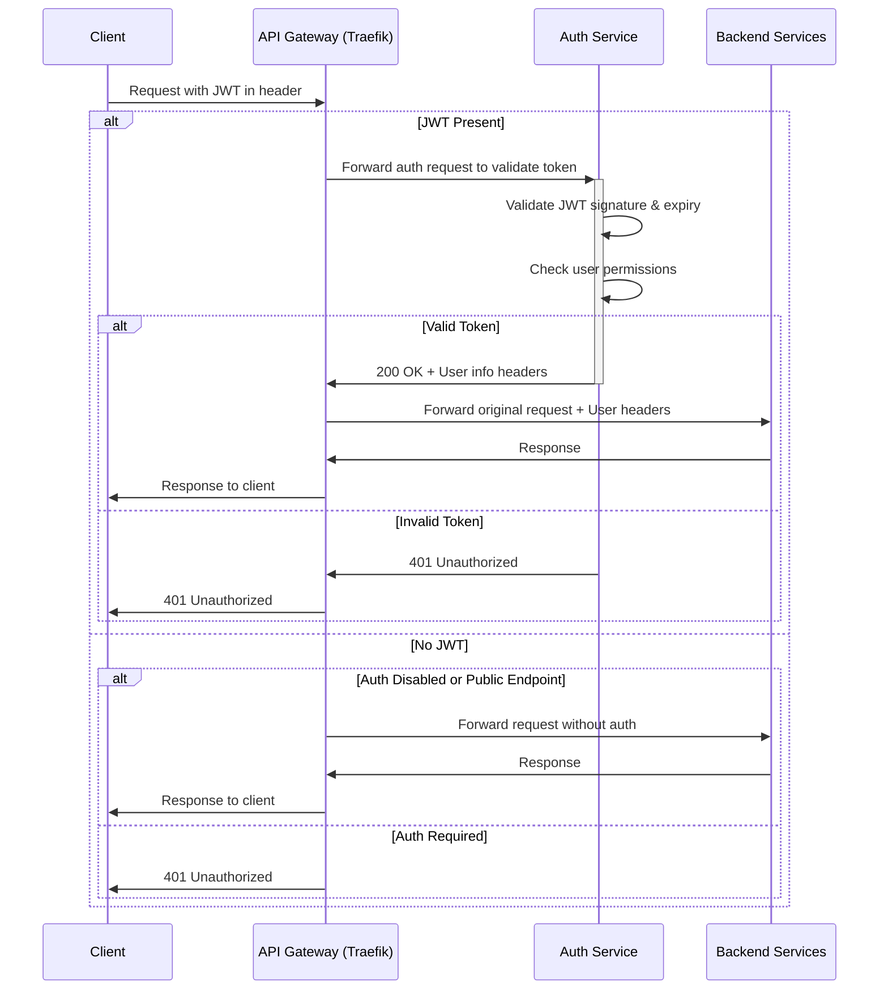

# AFWI MAGE Authentication Design for API Gateway

## Current Authentication Implementation

The AFWI MAGE platform currently uses JWT (JSON Web Token) based authentication implemented in the Auth Service (port 8010). Key components include:

1. **JWT Generation**: Tokens are created upon successful login with configurable expiration time
2. **Role-Based Access Control**: Users have one of three permission levels (admin, data_scientist, basic_user)
3. **Token Validation**: Currently performed within individual services

## Authentication Flow with API Gateway

We'll implement the following authentication flow for the API Gateway:



## Required Changes

### 1. New Auth Service Endpoint

We need to add a token validation endpoint to the Auth Service:

```python
@router.get("/validate-token")
async def validate_token(request: Request):
    auth_header = request.headers.get("Authorization")
    
    # Check if auth is disabled via environment variable
    if os.getenv("DISABLE_AUTH", "false").lower() == "true":
        # Add headers to identify this request as unauthenticated but allowed
        return JSONResponse(
            content={"status": "Auth disabled, access granted"},
            headers={"X-Auth-Status": "disabled", "X-Auth-User": "anonymous"}
        )
    
    # No token provided
    if not auth_header or not auth_header.startswith("Bearer "):
        raise HTTPException(
            status_code=status.HTTP_401_UNAUTHORIZED,
            detail="Missing or invalid authorization token",
            headers={"WWW-Authenticate": "Bearer"}
        )
    
    # Extract token
    token = auth_header.replace("Bearer ", "")
    
    try:
        # Decode JWT
        payload = jwt.decode(token, SECRET_KEY, algorithms=[ALGORITHM])
        username = payload.get("sub")
        
        if username is None:
            raise HTTPException(
                status_code=status.HTTP_401_UNAUTHORIZED,
                detail="Invalid token payload",
                headers={"WWW-Authenticate": "Bearer"}
            )
        
        # Get user from database
        db = next(get_db())
        user = db.query(User).filter(User.username == username).first()
        
        if user is None:
            raise HTTPException(
                status_code=status.HTTP_401_UNAUTHORIZED,
                detail="User not found",
                headers={"WWW-Authenticate": "Bearer"}
            )
        
        # Set user information headers to be forwarded to backend services
        headers = {
            "X-Auth-User": user.username,
            "X-Auth-Role": user.permission,
            "X-Auth-Status": "authenticated"
        }
        
        return JSONResponse(content={"authenticated": True}, headers=headers)
    
    except JWTError:
        raise HTTPException(
            status_code=status.HTTP_401_UNAUTHORIZED,
            detail="Invalid token",
            headers={"WWW-Authenticate": "Bearer"}
        )
```

### 2. API Gateway Authentication Middleware Configuration

We'll use Traefik's ForwardAuth middleware to implement authentication:

```yaml
# Middlewares configuration in Traefik
http:
  middlewares:
    auth-jwt:
      forwardAuth:
        address: "http://auth:8010/api/users/validate-token"
        trustForwardHeader: true
        authResponseHeaders:
          - "X-Auth-User"
          - "X-Auth-Role"
          - "X-Auth-Status"
```

### 3. Toggle Capability

To implement authentication toggling, we'll use:

1. **Environment variable**: `DISABLE_AUTH=true/false` in the Auth Service
2. **Service-specific toggles**: Apply auth middleware selectively to services
3. **Development profile**: Simpler configuration for development environments

### 4. Auth Bypass Mechanisms

For development environments, we'll implement these bypass options:

1. **Global auth bypass**: Setting `DISABLE_AUTH=true` in the auth service's environment
2. **Public routes**: Configuring some routes to skip authentication middleware
3. **Development tokens**: Long-lived tokens for development use
4. **Auth service mock**: A simplified auth service for development that always returns success

## JWT Validation Requirements

JWT tokens will be validated for:

1. **Signature validity**: Using the `SECRET_KEY` defined in the auth service
2. **Expiration time**: Checking that tokens haven't expired
3. **Token structure**: Verifying proper JWT format with required claims
4. **User existence**: Confirming the user still exists in the database

## Configuration Changes

### 1. Auth Service Environment Variables

```
# Add to auth_service/.env
DISABLE_AUTH=false                 # Set to true to disable auth globally
PUBLIC_PATHS=/api/health,/docs     # Paths that don't require authentication
DEV_MODE=false                     # Set to true in development environments
```

### 2. Traefik Configuration

```yaml
# Different middleware chains for different environments
http:
  middlewares:
    # Production auth middleware
    auth-jwt-prod:
      forwardAuth:
        address: "http://auth:8010/api/users/validate-token"
        trustForwardHeader: true
        authResponseHeaders:
          - "X-Auth-User"
          - "X-Auth-Role" 
          - "X-Auth-Status"
    
    # Development auth middleware (token validation with leniency)
    auth-jwt-dev:
      forwardAuth:
        address: "http://auth:8010/api/users/validate-token?dev_mode=true"
        trustForwardHeader: true
        authResponseHeaders:
          - "X-Auth-User"
          - "X-Auth-Role"
          - "X-Auth-Status"
    
    # No auth middleware for auth disabled mode
    auth-none:
      headers:
        customRequestHeaders:
          X-Auth-Status: "disabled"
          X-Auth-User: "anonymous"
          X-Auth-Role: "anonymous"
```

## Security Considerations

1. **Token Security**:
   - Use adequate key length for `SECRET_KEY` (minimum 32 bytes of entropy)
   - Set appropriate expiration times for tokens (default: 30 minutes)
   - Consider implementing token refresh mechanism

2. **Auth Bypass Risks**:
   - Never enable auth bypass in production environments
   - Document clearly when auth bypass is acceptable
   - Log all auth bypass activations

3. **JWT Best Practices**:
   - Use HTTPS for all authenticated requests
   - Implement proper CORS policies
   - Consider implementing token revocation for critical scenarios

## Implementation Plan

1. **Add Validation Endpoint**:
   - Create the `/api/users/validate-token` endpoint in the Auth Service
   - Support the `DISABLE_AUTH` environment variable
   - Handle missing or invalid tokens properly

2. **Configure Traefik Middleware**:
   - Set up ForwardAuth middleware in Traefik configuration
   - Configure auth header forwarding
   - Test with and without valid tokens

3. **Implement Auth Bypassing**:
   - Create development mode configuration
   - Test auth bypassing mechanisms
   - Document usage patterns for developers

4. **Update Docker Compose**:
   - Update environment variables in docker-compose.yml
   - Ensure proper service dependencies
   - Add labels for Traefik integration

## Testing Authentication Flow

1. **Valid Authentication Test**:
   - Obtain valid JWT token through login
   - Access protected endpoint through API Gateway
   - Verify successful response

2. **Invalid Authentication Test**:
   - Use expired or malformed token
   - Access protected endpoint
   - Verify 401 Unauthorized response

3. **Auth Bypass Test**:
   - Set `DISABLE_AUTH=true`
   - Access protected endpoint without token
   - Verify successful response

4. **Public Endpoint Test**:
   - Access public endpoint without token
   - Verify successful response

5. **Authorization Test**:
   - Access admin-only endpoint with non-admin token
   - Verify 403 Forbidden response 