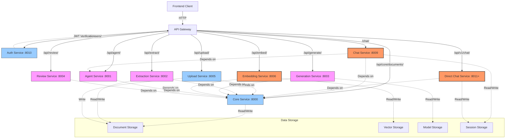

# AFWI MAGE Service Relationships

## Key Observations

1. **Central Dependencies**:
   - Core Service is a central dependency for most services
   - JWT authentication is a central dependency for the API Gateway

2. **Service Clusters**:
   - Chat Services (Chat + Direct Chat): User-facing conversational interfaces
   - Document Services (Upload + Extraction + Embedding): Document handling pipeline
   - AI Services (Agent + Generation): AI model and team management
   - Support Services (Auth + Review): Security and moderation

3. **Deployment Considerations**:
   - High-traffic services (Chat, Direct Chat, Embedding) should be prioritized for scaling
   - Core Service and Auth Service are critical path services that require high availability
   - Service-to-service communication happens internally via Docker network

4. **Potential Bottlenecks**:
   - Core Service is a central dependency - should be monitored closely
   - Auth Service validation can become a bottleneck - consider caching
   - File upload handling can consume significant resources - needs rate limiting

## Gateway Implementation Strategy

Given the service relationships, the API Gateway should:

1. Route requests based on path prefixes to the appropriate services
2. Implement JWT validation middleware for secured services
3. Apply service-specific rate limiting based on traffic patterns
4. Provide circuit breaking for service failure isolation
5. Implement retries for critical services like Core and Auth 